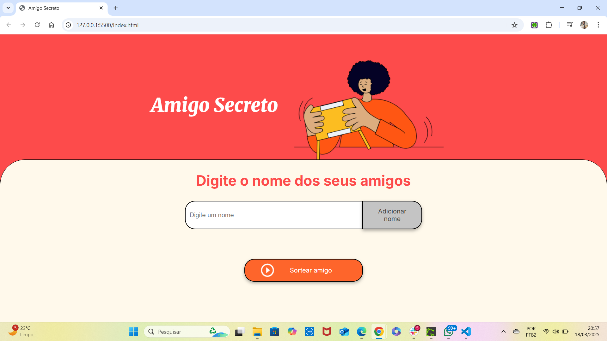
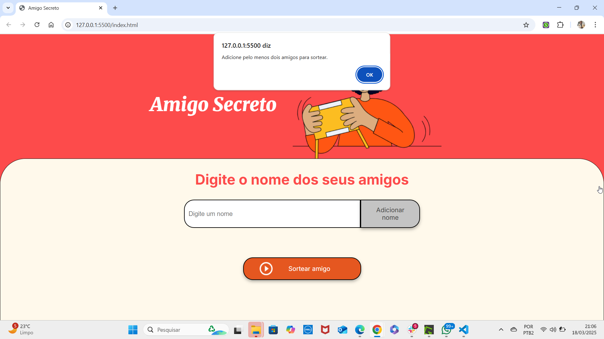
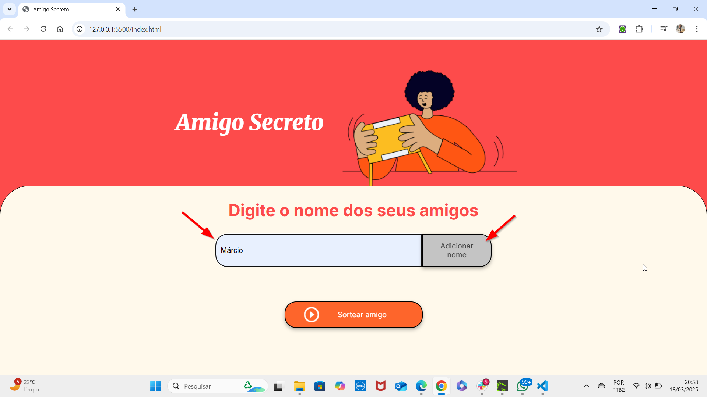
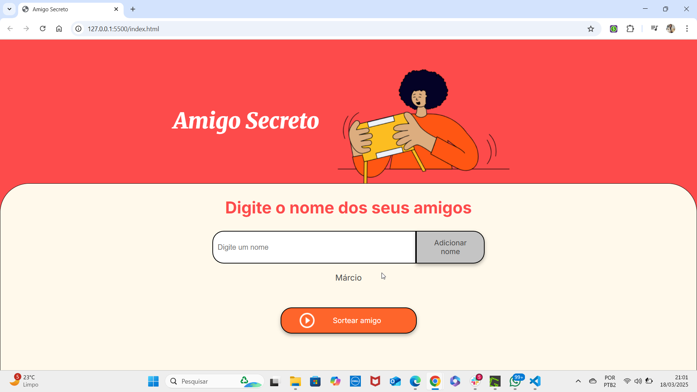
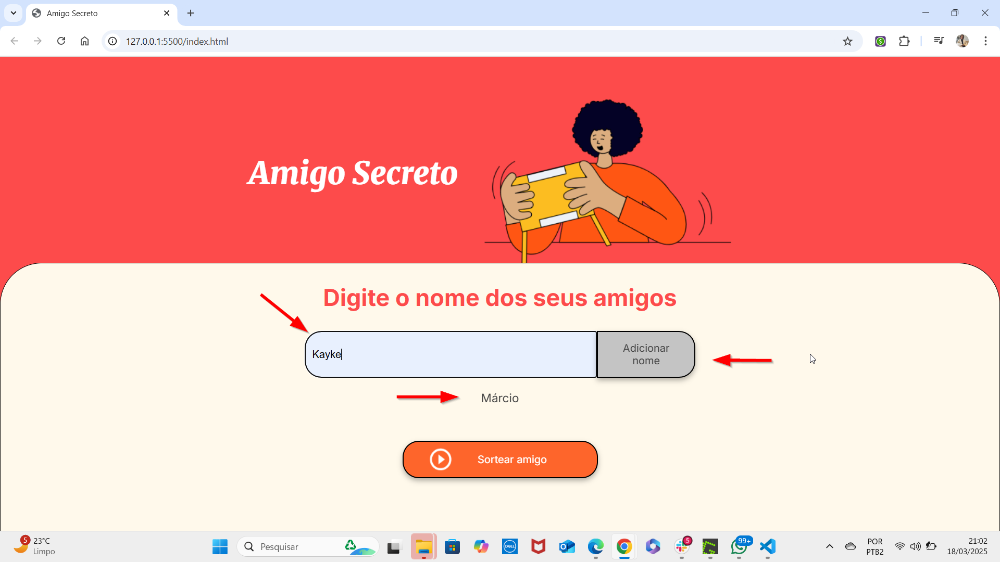
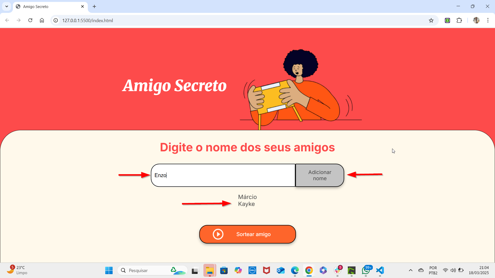
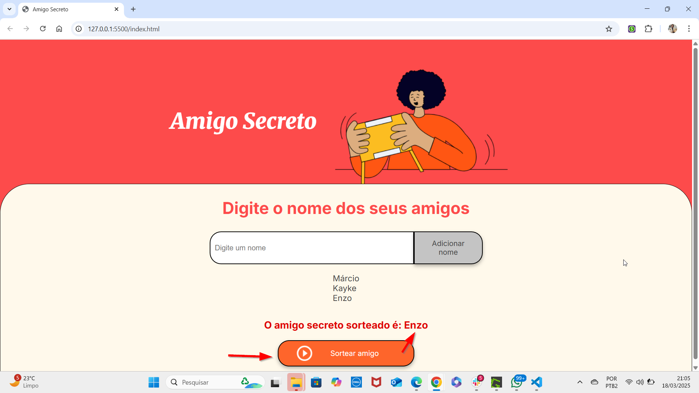

# sorteio-amigo-secreto
Projeto desenvolvido no curso de HTML e CSS da Alura, no Programa One Oracle Next Education.

# Amigo Secreto

Este é um projeto web desenvolvido para facilitar a brincadeira de Amigo Secreto. O aplicativo permite que os usuários insiram nomes, adicione-os a uma lista e realize o sorteio para determinar quem será o "amigo secreto" de quem. A interface é simples, intuitiva e utiliza HTML, CSS e JavaScript.

## Funcionalidades

- **Adicionar nomes à lista**: Permite que os usuários insiram os nomes dos participantes.
- **Exibição da lista de nomes**: Os nomes adicionados são exibidos dinamicamente na página.
- **Sorteio do Amigo Secreto**: Com apenas um clique, realiza o sorteio aleatório entre os participantes.
- **Interface acessível**: Segue práticas de acessibilidade, como o uso de atributos `aria-label` e `aria-live`.
- **Design responsivo**: Adaptado para dispositivos móveis e desktops.

## Estrutura do Projeto

- **HTML**: Estrutura principal da aplicação e elementos interativos.
- **CSS**: Design estilizado e responsivo, incluindo integração com Google Fonts.
- **JavaScript**: Lógica para adição de nomes e realização do sorteio.

